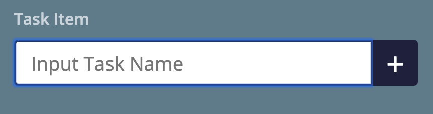
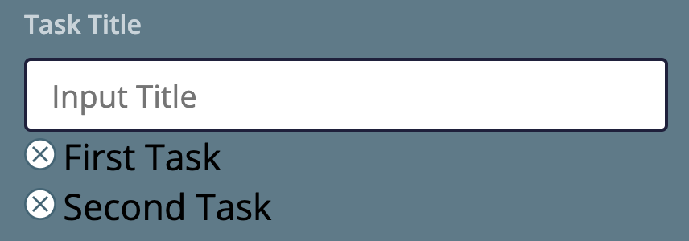
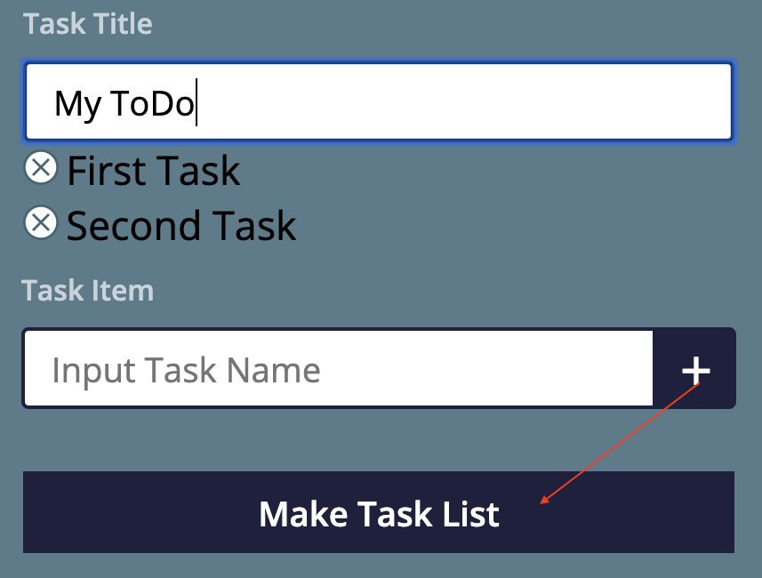
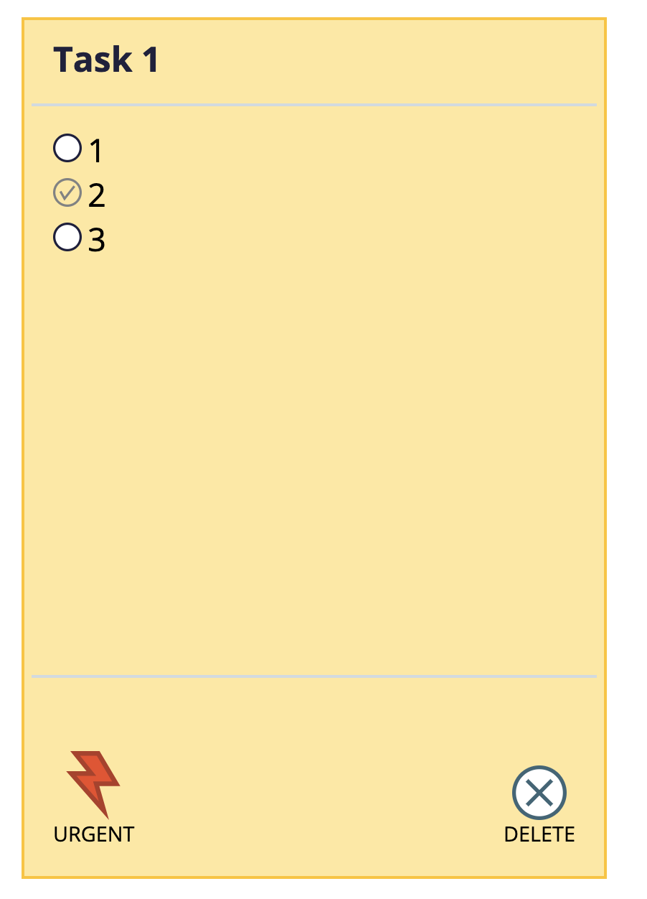
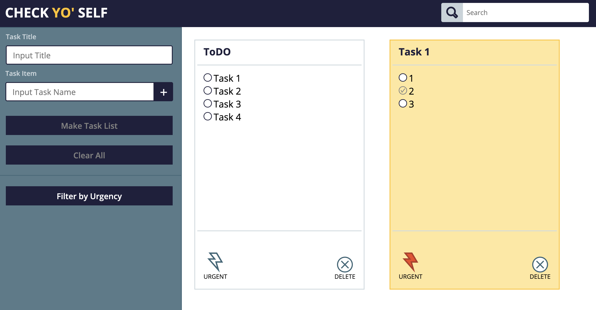

# Check Yo' Self

Do you miss appointments all the time? Do you forget to get potatoes or
eggs when you go grocery shopping?
Say hello to Check Yo’Self.
The most advanced (when it works) ToDo list web app to ever hit the interwebs.

But in all seriousness Check Yo’Self is the final independent/solo project for the Front End Mod 1 at Turing School of Software and Design.  The main goal of this project was to build a web application that uses nested objects, nested arrays and complex methods and keeps Data Model separate from Document Object Model.

Check Yo’Self allows you to create todos with task. Todos can be marked urgent and task can be checked off as completed.

## Installing / Getting started

Clone down the repo. Use terminal commands to navigate to the root folder of the repo locally. open index.html in browser.

## Steps to use the App

 1. Create your first task by typing in the name of the task in the second input field called "Input Task Name" and
 click plus button next to Input Task Field.

2.  You can create as many task as you want. When you are done with your task. Go up to "Input Title" and type in the name
of your TODO list.

3. After you type in the title of your todo task click "Make Task List" button

4. After you click "Make Task List" button a new task card will show up on the right side of the screen. You can click the
check boxes to mark youre task completed. You can also mark youre todo list  "Urgent" and aslo you can remove the entire card.

### Technologies Used

* HTML
* CSS
* Vanilla JavaScript  

## Learning Goals

* Solidify and demonstrate understanding of the following:
* JavaScript Objects
* Array Prototypes
* localStorage for data persistency
* For Loops
* Understand separation of DOM and Data Model

## Challenges

The hardest part of this project was updating Data Model and interacting with Local Storage.
The code needs major refactoring to reduce repetitive code. Additionally I still need to
work on Git workflow, I did not do a good committing, adding and branching at the correct
points of the project.

## Wins
Biggest win of this project was grasping a better understanding of object manipulation and using
array prototypes.

### Prerequisites

No prerequisites are required to use this “App”. It’s recommended to use Chrome. “App” works in Safari also.  

